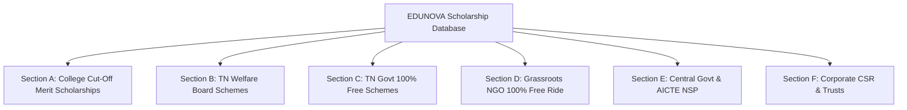

# ERE-TN — Master Scholarship & Opportunities Database

> **Version:** 2.0 (Verified for 2026 Academic Year)  
> **Target Scope:** Class 12 Passed Students in Tamil Nadu (Engineering, Medical, Arts & Science, Diploma & Professional Degrees)  
> **Schema Mapping:** Direct mapping to ERE-TN Backend Entities (`opportunities`, `providers`, `institutions`, `opportunity_eligibility`, `opportunity_benefits`, `opportunity_documents`, `opportunity_application_steps`, `opportunity_deadlines`).

---

## 1. Database Schema & Field Mapping Specification

Every record in this database is normalized for the `edunova` database engine with the following attributes:

| Entity Field | Data Type | Description & Constraints |
| :--- | :--- | :--- |
| `id` | `VARCHAR(80)` | Unique primary key (e.g. `opp-rit-sabari-190`, `opp-tn-75-govt-school`) |
| `title` | `VARCHAR(400)` | Full official title of the scholarship/opportunity |
| `provider_id` | `VARCHAR(80)` | Foreign key reference to `providers(id)` |
| `institution_id` | `VARCHAR(80)` | Foreign key reference to `institutions(id)` (NULL for open schemes) |
| `opportunity_type` | `ENUM` | `SCHOLARSHIP`, `FELLOWSHIP`, `GRANTS`, `INTERNSHIP`, `COMPETITION` |
| `government_level` | `ENUM` | `STATE_GOVERNMENT`, `CENTRAL_GOVERNMENT`, `NON_PROFIT_TRUST`, `CORPORATE_CSR`, `INSTITUTION_MERIT` |
| `education_level` | `VARCHAR(40)` | `HIGHER_SECONDARY_12TH`, `UNDERGRADUATE`, `DIPLOMA`, `POSTGRADUATE` |
| `tuition_fee_support` | `BOOLEAN` | `TRUE` if 100% or partial tuition fee is covered |
| `hostel_support` | `BOOLEAN` | `TRUE` if free hostel/mess or boarding allowance is covered |
| `min_cutoff_marks` | `NUMERIC(5,2)` | TNEA Cut-Off (out of 200) or Board percentage |
| `max_family_income` | `BIGINT` | Annual income threshold in INR (0 = No income limit) |
| `social_category` | `VARCHAR(80)` | `ALL`, `SC`, `ST`, `SCA`, `SCC`, `BC`, `MBC`, `DNC`, `MINORITY`, `OC` |

---

## 2. Master Records Catalogue

---

### SECTION A: College-Specific Cut-Off Merit Scholarships (Tamil Nadu)

#### 1. `opp-rit-sabari-190-free` — RIT & REC 100% Full Scholarship (Cut-Off 190+)
* **Provider:** `prov-sabari-foundation` (Sabari Foundation / Rajalakshmi Educational Trust)
* **Institution:** `inst-rit-chennai` (Rajalakshmi Institute of Technology / Rajalakshmi Engineering College)
* **Opportunity Type:** `SCHOLARSHIP` | **Level:** `INSTITUTION_MERIT`
* **Eligibility:**
  * **Cut-Off:** TNEA Cut-off $\ge 190.00 / 200$ in 12th Board Examinations.
  * **Stream:** PCM (Physics, Chemistry, Maths) eligible for B.E. / B.Tech admissions.
  * **Income Limit:** No ceiling (Open to all merit students).
* **Benefits:**
  * **100% Free Tuition Fee** for all 4 years of study.
  * **100% Free Hostel & Mess Accommodation** OR **100% Free College Bus Transportation**.
  * **Financial Value:** $\approx$ ₹1,75,000 to ₹2,20,000 per year.
* **Required Documents:** 10th & 12th Marksheets, TNEA Allotment/Rank Certificate, TC, Community Certificate, Aadhaar Card, Passport Size Photos.
* **Official URL:** [ritchennai.org](https://www.ritchennai.org) | [rajalakshmi.org](https://www.rajalakshmi.org)
* **Application Method:** Direct at College Admissions Office / TNEA Single Window Choice Filling.

---

#### 2. `opp-rit-sabari-180-half` — RIT & REC 50% Merit Scholarship (Cut-Off 180 – 189.5)
* **Provider:** `prov-sabari-foundation` (Sabari Foundation / Rajalakshmi Educational Trust)
* **Institution:** `inst-rit-chennai`
* **Opportunity Type:** `SCHOLARSHIP` | **Level:** `INSTITUTION_MERIT`
* **Eligibility:** TNEA Cut-off between $180.00$ and $189.50 / 200$.
* **Benefits:**
  * **50% Tuition Fee Concession** for all 4 years.
  * **50% Concession on Hostel/Mess** or College Bus transport charges.
* **Required Documents:** 12th Marksheet, Aadhaar Card, Community Certificate, Transfer Certificate.
* **Official URL:** [ritchennai.org](https://www.ritchennai.org)

---

#### 3. `opp-ssn-merit-full-195` — SSN 100% Free Education & Rural Topper Scholarship
* **Provider:** `prov-shiv-nadar-foundation` (SSN Trust / Shiv Nadar Foundation)
* **Institution:** `inst-ssn-chennai` (SSN College of Engineering, Chennai)
* **Opportunity Type:** `SCHOLARSHIP` | **Level:** `INSTITUTION_MERIT`
* **Eligibility:**
  * Top 25 State Board Rankers OR TNEA Cut-off $\ge 195.00 / 200$.
  * Dedicated 25 free seats for Rural Government School toppers in Tamil Nadu.
* **Benefits:**
  * **100% Free Tuition Fee Waiver** + Free Shared Hostel + Free Food + Annual Book Allowance.
  * **Financial Value:** Up to ₹2,50,000 per year.
* **Official URL:** [ssn.edu.in](https://www.ssn.edu.in/scholarships/)

---

#### 4. `opp-sairam-leomuthu-190` — Sri Sairam Leo Muthu 100% Free Seat (Cut-Off 190+)
* **Provider:** `prov-sapthagiri-trust` (Sapthagiri Educational Trust / Leo Muthu Foundation)
* **Institution:** `inst-sairam-chennai` (Sri Sairam Engineering College / Sairam Institute of Tech)
* **Opportunity Type:** `SCHOLARSHIP` | **Level:** `INSTITUTION_MERIT`
* **Eligibility:** 12th Cut-Off $\ge 190.00 / 200$.
* **Benefits:** 100% Tuition Fee Waiver + 100% Free Hostel/Mess or College Bus Transport.
* **Official URL:** [sairam.edu.in](https://sairam.edu.in)

---

#### 5. `opp-sairam-leomuthu-180` — Sri Sairam 50% Fee Concession (Cut-Off 180 – 189.5)
* **Provider:** `prov-sapthagiri-trust`
* **Institution:** `inst-sairam-chennai`
* **Eligibility:** 12th Cut-off between $180.00$ and $189.50 / 200$.
* **Benefits:** 50% Concession on Tuition Fees.
* **Official URL:** [sairam.edu.in](https://sairam.edu.in)

---

#### 6. `opp-bit-bannari-190` — Bannari Amman (BIT) 100% Full Scholarship (Cut-Off 190+)
* **Provider:** `prov-bannari-amman-trust` (Bannari Amman Educational Trust)
* **Institution:** `inst-bit-sathy` (Bannari Amman Institute of Technology, Sathyamangalam)
* **Eligibility:** Cut-Off $\ge 190.00 / 200$.
* **Benefits:** **100% Free Tuition Fee + 100% Free Hostel Accommodation & Mess Food**.
* **Official URL:** [bitsathy.ac.in](https://www.bitsathy.ac.in)

---

#### 7. `opp-kpr-charities-190` — KPR 100% Free Higher Education Scheme (Cut-Off 190+)
* **Provider:** `prov-kpr-charities` (KPR Charities & Educational Trust)
* **Institution:** `inst-kpr-coimbatore` (KPR Institute of Engineering and Technology)
* **Eligibility:** Cut-Off $\ge 190.00 / 200$ in 12th.
* **Benefits:** 100% Tuition Fee Waiver + Free Hostel & Food. (Cut-off 180-189 gets 50% waiver).
* **Official URL:** [kpriet.ac.in](https://kpriet.ac.in)

---

#### 8. `opp-skcet-vlb-190` — Sri Krishna (SKCET & SKCT) VLB Merit Waiver (Cut-Off 190+)
* **Provider:** `prov-vlb-trust` (V.L.B. Trust, Coimbatore)
* **Institution:** `inst-skcet-coimbatore` (Sri Krishna College of Engineering and Technology)
* **Eligibility:** Cut-Off $\ge 190.00 / 200$ (100% waiver) | Cut-off 185–189.5 (50% waiver).
* **Benefits:** 100% / 50% Academic Tuition Fee Waivers.
* **Official URL:** [skcet.ac.in](https://www.skcet.ac.in)

---

#### 9. `opp-saveetha-merit-190` — Saveetha Engineering College 100% Free Tuition Scheme
* **Provider:** `prov-saveetha-trust` (Saveetha Educational Trust)
* **Institution:** `inst-saveetha-chennai` (Saveetha Engineering College, Chennai)
* **Eligibility:** Cut-Off $\ge 190.00 / 200$ or PCM aggregate $\ge 95\%$.
* **Benefits:** 100% Tuition fee waiver for 4 years (Cut-off 180–189 receives 50% waiver).
* **Official URL:** [saveetha.ac.in](https://saveetha.ac.in)

---

#### 10. `opp-veltech-mahatma-merit` — Vel Tech Mahatma Gandhi National Merit Scholarship
* **Provider:** `prov-veltech-trust` (Vel Tech Rangarajan Dr. Sagunthala R&D Institute)
* **Eligibility:** PCM Board Percentage $\ge 95\%$ (100% fee waiver), 90–94.9% (75% waiver), 80–89.9% (50% waiver).
* **Benefits:** Up to 100% Tuition and Hostel fee waivers.
* **Official URL:** [veltech.edu.in](https://www.veltech.edu.in)

---

### SECTION B: Tamil Nadu Labour & Unorganized Welfare Board Scholarships

#### 11. `opp-tn-construction-board-edu` — TN Construction Workers Welfare Board Educational Grant
* **Provider:** `prov-tn-cuwwb` (Tamil Nadu Construction Workers Welfare Board / TNCWWB)
* **Government Level:** `STATE_GOVERNMENT` | **Education Level:** `UNDERGRADUATE`, `DIPLOMA`
* **Eligibility:**
  * Either father or mother must be an active registered member in the TN Construction Workers Welfare Board.
  * Student enrolled in regular recognized UG Arts/Science, Engineering, Medicine, Agriculture, or Law.
* **Benefits:**
  * Arts & Science UG: ₹1,500 to ₹3,000/year (Hosteller: Extra ₹1,500/year).
  * Professional Degree (B.E./B.Tech/MBBS/Agri/Law): ₹4,000 to ₹6,000/year (Hosteller: Up to ₹12,000/year).
* **Official Portal:** [tnuwwb.tn.gov.in](https://tnuwwb.tn.gov.in)
* **Required Documents:** Parent's Welfare Board Membership Passbook, Student 12th Marksheet, Study Certificate from College Principal, Aadhaar Card, Student Bank Passbook.

---

#### 12. `opp-tn-manual-unorganized-edu` — TN Unorganized Workers Welfare Board Educational Scheme
* **Provider:** `prov-tn-unorganized-board` (TN Manual Workers / Auto Drivers / Tailoring Welfare Boards)
* **Government Level:** `STATE_GOVERNMENT`
* **Eligibility:** Wards of registered unorganized workers across 18 notified craft welfare boards.
* **Benefits:** Fixed annual educational stipend & hostel assistance deposited directly to student bank account.
* **Official Portal:** [tnuwwb.tn.gov.in](https://tnuwwb.tn.gov.in)

---

#### 13. `opp-tn-labour-welfare-fund` — Tamil Nadu Labour Welfare Board Scholarship (Organized Sector)
* **Provider:** `prov-tn-labour-welfare` (Tamil Nadu Labour Welfare Board, Chennai)
* **Government Level:** `STATE_GOVERNMENT`
* **Eligibility:** Children of workers contributing to the Tamil Nadu Labour Welfare Fund (Basic salary $\le$ ₹25,000/month).
* **Benefits:** Engineering/Medicine: ₹12,000 – ₹50,000/year; Arts/Science: ₹3,000 – ₹10,000/year + Book Allowance.
* **Official Portal:** [labour.tn.gov.in](https://labour.tn.gov.in)

---

### SECTION C: Tamil Nadu State Government Flagship 100% Free Schemes

#### 14. `opp-tn-75-govt-school` — Tamil Nadu 7.5% Government School Quota (100% Free Ride)
* **Provider:** `prov-tn-higher-edu` (Department of Higher Education, Govt of Tamil Nadu)
* **Government Level:** `STATE_GOVERNMENT`
* **Eligibility:**
  * Studied from Class 6 to Class 12 continuously in Tamil Nadu Government Schools.
  * Admitted into Engineering (TNEA), Medical (NEET), Agriculture (TNAU), Veterinary (TANUVAS), Fisheries (TNJFU), or Law (TNDALU) through Single Window Counseling.
* **Benefits:** **100% Full Free Education** (Complete Tuition fees, Special fees, Hostel fees, Mess food, and University Exam fees paid by TN Government).
* **Official Source:** [tneaonline.org](https://www.tneaonline.org) | [tn.gov.in](https://www.tn.gov.in)

---

#### 15. `opp-tn-first-graduate` — Tamil Nadu First Graduate Tuition Fee Concession
* **Provider:** `prov-tn-higher-edu`
* **Government Level:** `STATE_GOVERNMENT`
* **Eligibility:** First person in the entire family to graduate from college; admitted via TNEA / Govt Counseling. No family income ceiling.
* **Benefits:** ₹25,000/year (Non-accredited courses) or ₹27,500/year (Accredited courses) direct tuition fee deduction.
* **Required Documents:** First Graduate Certificate & Joint Declaration issued by Tahsildar / e-Sevai.

---

#### 16. `opp-tn-pudhumai-penn` — Moovalur Ramamirtham Ammaiyar "Pudhumai Penn" Thittam
* **Provider:** `prov-tn-social-welfare` (Department of Social Welfare & Women Empowerment, TN)
* **Government Level:** `STATE_GOVERNMENT`
* **Eligibility:** Girl students who studied from Class 6 to 12 in Tamil Nadu Government Schools pursuing any regular UG Degree / Diploma.
* **Benefits:** **₹1,000 per month** (₹12,000/year) credited directly to bank account until degree completion.
* **Official Portal:** [pudhumaipenn.tn.gov.in](https://pudhumaipenn.tn.gov.in)

---

#### 17. `opp-tn-tamil-pudhalvan` — Tamil Pudhalvan Thittam (Boys Higher Education Assistance)
* **Provider:** `prov-tn-social-welfare`
* **Government Level:** `STATE_GOVERNMENT`
* **Eligibility:** Male students who studied from Class 6 to 12 in TN Govt / Govt-Aided (Tamil Medium) schools enrolled in regular UG/Diploma courses.
* **Benefits:** **₹1,000 per month** (₹12,000/year) direct monthly allowance for academic materials and books.
* **Official Portal:** [tamilpudhalvan.tn.gov.in](https://www.tn.gov.in)

---

#### 18. `opp-tn-postmatric-scst` — Tamil Nadu Post-Matric Free Education for SC / ST / SCA / SCC
* **Provider:** `prov-tn-adi-dravidar` (Adi Dravidar and Tribal Welfare Department, TN)
* **Government Level:** `STATE_GOVERNMENT`
* **Eligibility:** SC, ST, SCA, and SCC (Converted Christians) students with annual family income $< ₹2,50,000$.
* **Benefits:** **100% Full Tuition Fee Waiver** in Govt and Self-Financing colleges + Monthly Maintenance Allowance.
* **Official Portal:** [escholarship.tn.gov.in](https://escholarship.tn.gov.in)

---

#### 19. `opp-tn-postmatric-bcmbc` — Tamil Nadu Post-Matric Scholarship for BC / MBC / DNC
* **Provider:** `prov-tn-bcmbc` (BC, MBC & Minorities Welfare Department, TN)
* **Government Level:** `STATE_GOVERNMENT`
* **Eligibility:** BC, MBC, DNC students with family annual income $< ₹2,50,000$ studying in regular UG/Professional courses.
* **Benefits:** Tuition fee reimbursement in Govt/Govt-Aided colleges + Non-refundable fees and maintenance allowance.
* **Official Portal:** [bcmbcmw.tn.gov.in](https://bcmbcmw.tn.gov.in)

---

### SECTION D: Grassroots NGOs & Foundations (100% Free Higher Education)

#### 20. `opp-agaram-vidhai` — Agaram Foundation "Vidhai" Higher Education Sponsorship
* **Provider:** `prov-agaram-foundation` (Agaram Foundation)
* **Level:** `NON_PROFIT_TRUST`
* **Eligibility:** Economically underprivileged rural students, orphans, single-parent children from Tamil Nadu with exceptional 12th board marks.
* **Benefits:** **100% Free Higher Education** (Tuition Fees + Hostel Accommodation + Mess Food + Mentorship + Placement Training).
* **Official URL:** [agaram.in](https://agaram.in)
* **Application Mode:** Physical/Online Form immediately following 12th results $\rightarrow$ Home Verification.

---

#### 21. `opp-maatram-foundation` — Maatram Foundation 100% Free Higher Education Scheme
* **Provider:** `prov-maatram-foundation` (Maatram Foundation)
* **Level:** `NON_PROFIT_TRUST`
* **Eligibility:** Meritorious students from economically backward families, children of daily wage earners, first-generation graduates across TN.
* **Benefits:** **100% Free Higher Education** (Zero Tuition, Zero Hostel, Zero Mess, Zero Bus Fee across top partner colleges).
* **Official URL:** [maatramfoundation.com](https://maatramfoundation.com)

---

#### 22. `opp-anandam-youth` — Anandam Youth Foundation Sponsorship Program
* **Provider:** `prov-anandam-foundation` (Anandam Youth Foundation)
* **Level:** `NON_PROFIT_TRUST`
* **Eligibility:** Rural poor students from Tamil Nadu with strong 12th marks seeking engineering or arts degrees.
* **Benefits:** 100% College Tuition + Hostel + Boarding + Free Laptop + Mentoring.
* **Official URL:** [anandam.org](https://anandam.org)

---

#### 23. `opp-team-everest-future` — Team Everest NGO "I am the Future" Scholarship
* **Provider:** `prov-team-everest` (Team Everest NGO)
* **Level:** `NON_PROFIT_TRUST`
* **Eligibility:** Single parent, parentless (orphan), or differently-abled parent students in Tamil Nadu. Minimum 70% in 12th.
* **Benefits:** **100% Tuition Fees Paid** for 3/4-year degree + 100 hours of Employability Skills Coaching.
* **Official URL:** [teameverest.ngo](https://www.teameverest.ngo)

---

#### 24. `opp-dream-india-trust` — Dream India Educational Trust Scholarship
* **Provider:** `prov-dream-india` (Dream India Educational Trust)
* **Level:** `NON_PROFIT_TRUST`
* **Eligibility:** Deserving students from Tamil Nadu Government Schools entering college.
* **Benefits:** Direct college fee sponsorships, books, and living support.
* **Official URL:** [dreamindia.org](https://www.dreamindia.org)

---

### SECTION E: Central Government & AICTE Scholarships (National Scholarship Portal)

#### 25. `opp-nsp-pm-usp-csss` — Central Sector Scheme of Scholarship (PM-USP / CSSS)
* **Provider:** `prov-moe-india` (Ministry of Education, Govt of India)
* **Government Level:** `CENTRAL_GOVERNMENT`
* **Eligibility:** Scored above **80th percentile** in 12th Board Exams; Family income $< ₹4,50,000$/year.
* **Benefits:** **₹12,000/year** (Years 1 to 3 of UG) and **₹20,000/year** (Years 4 & 5).
* **Official Portal:** [scholarships.gov.in](https://scholarships.gov.in)

---

#### 26. `opp-aicte-pragati-girls` — AICTE Pragati Scholarship for Girl Students
* **Provider:** `prov-aicte-india` (All India Council for Technical Education)
* **Government Level:** `CENTRAL_GOVERNMENT`
* **Eligibility:** Up to 2 girl children per family admitted to 1st year AICTE-approved B.E./B.Tech/Diploma; Income $< ₹8,00,000$/year.
* **Benefits:** **₹50,000 per year** for all 4 years of study towards tuition fees and college expenses.
* **Official Portal:** [scholarships.gov.in](https://scholarships.gov.in)

---

#### 27. `opp-aicte-saksham-pwd` — AICTE Saksham Scholarship for Specially-Abled Students
* **Provider:** `prov-aicte-india`
* **Government Level:** `CENTRAL_GOVERNMENT`
* **Eligibility:** Specially-abled students (Disability $\ge 40\%$) admitted to AICTE degree/diploma; Income $< ₹8,00,000$/year.
* **Benefits:** **₹50,000 per year** for every year of study.
* **Official Portal:** [scholarships.gov.in](https://scholarships.gov.in)

---

#### 28. `opp-aicte-swanath` — AICTE Swanath Scholarship Scheme
* **Provider:** `prov-aicte-india`
* **Government Level:** `CENTRAL_GOVERNMENT`
* **Eligibility:** Orphaned students, wards of parents who died due to COVID-19, or wards of Armed Forces martyrs.
* **Benefits:** **₹50,000 per year** for entire degree duration.
* **Official Portal:** [scholarships.gov.in](https://scholarships.gov.in)

---

#### 29. `opp-nsp-postmatric-minority` — Central Post-Matric Scholarship for Minorities
* **Provider:** `prov-moma-india` (Ministry of Minority Affairs, Govt of India)
* **Government Level:** `CENTRAL_GOVERNMENT`
* **Eligibility:** Muslim, Christian, Sikh, Buddhist, Jain, Parsi students with $\ge 50\%$ in 12th; Family income $< ₹2,00,000$/year.
* **Benefits:** Full tuition fee reimbursement + annual maintenance allowance.
* **Official Portal:** [scholarships.gov.in](https://scholarships.gov.in)

---

### SECTION F: Corporate CSR & Major Private Trust Scholarships

#### 30. `opp-siemens-scholarship` — Siemens Scholarship Program (100% Full Tuition + Laptop)
* **Provider:** `prov-siemens-foundation` (Siemens India Foundation)
* **Level:** `CORPORATE_CSR`
* **Eligibility:** 1st-year students of **Government Engineering Colleges** in Mech, EEE, ECE, CS, IT; 12th PCM $\ge 60\%$; Income $< ₹2,50,000$/year.
* **Benefits:** **100% Tuition Fees Paid** + Annual Book Allowance + Free Laptop + Siemens Industrial Training.
* **Official URL:** [siemens.co.in](https://www.siemens.com/in/en/company/sustainability/corporate-citizenship/siemens-scholarship-program.html)

---

#### 31. `opp-reliance-foundation-ug` — Reliance Foundation Undergraduate Scholarship
* **Provider:** `prov-reliance-foundation` (Reliance Foundation)
* **Level:** `CORPORATE_CSR`
* **Eligibility:** 1st-year full-time UG students with $\ge 60\%$ in 12th; Family annual income $< ₹15,00,000$ (preference $< ₹2.5\text{L}$).
* **Benefits:** Up to **₹2,00,000 total financial grant** across the degree program.
* **Official Portal:** [scholarships.reliancefoundation.org](https://scholarships.reliancefoundation.org)

---

#### 32. `opp-kotak-kanya-girls` — Kotak Kanya Scholarship (Girls in Professional Degrees)
* **Provider:** `prov-kotak-foundation` (Kotak Education Foundation)
* **Level:** `CORPORATE_CSR`
* **Eligibility:** Meritorious girl students with $\ge 85\%$ in 12th admitted to 1st year Engineering, MBBS, Architecture, or Integrated Law; Income $< ₹6,00,000$.
* **Benefits:** **₹1,50,000 per year** towards tuition, hostel, laptop, and academic expenses until graduation.
* **Official Portal:** [kotakeducation.org](https://kotakeducation.org)

---

#### 33. `opp-hdfc-parivartan-ecss` — HDFC Bank Parivartan's ECSS Programme
* **Provider:** `prov-hdfc-foundation` (HDFC Bank Parivartan CSR)
* **Level:** `CORPORATE_CSR`
* **Eligibility:** Students pursuing general UG or professional courses; 12th marks $\ge 55\%$; Income $< ₹2,50,000$/year.
* **Benefits:** **₹30,000 to ₹75,000 per year** regular annual disbursement.
* **Official Portal:** [Buddy4Study / HDFC Parivartan](https://www.buddy4study.com/page/hdfc-bank-parivartans-ecss-programme)

---

#### 34. `opp-wipro-santoor-girls` — Santoor Women’s Scholarship (Wipro Consumer Care)
* **Provider:** `prov-wipro-foundation` (Wipro Consumer Care & Wipro Cares)
* **Level:** `CORPORATE_CSR`
* **Eligibility:** Girl students from Tamil Nadu who completed 10th & 12th in Govt/Govt-Aided schools enrolled in regular 3/4-year UG courses.
* **Benefits:** **₹24,000 per year** until completion of graduation.
* **Official Portal:** [santoorscholarship.com](https://www.santoorscholarship.com)

---

#### 35. `opp-federal-bank-hormis` — Federal Bank Hormis Memorial Foundation Scholarship
* **Provider:** `prov-federal-bank` (Federal Bank Hormis Memorial Foundation)
* **Level:** `CORPORATE_CSR`
* **Eligibility:** 1st-year students admitted on merit in MBBS, Engineering, Agriculture, Nursing, or MBA; Income $< ₹3,00,000$.
* **Benefits:** **100% Tuition Fee Refund** + University and examination fee coverage.
* **Official Portal:** [federalbank.co.in](https://www.federalbank.co.in)

---

#### 36. `opp-dr-reddys-sashakt` — Dr. Reddy’s Foundation "Sashakt" Scholarship (Girls in Science)
* **Provider:** `prov-dr-reddys` (Dr. Reddy’s Foundation)
* **Level:** `CORPORATE_CSR`
* **Eligibility:** Girl students with strong 12th science marks admitted to 3-year pure science B.Sc. degrees (Physics, Chemistry, Maths, Biology).
* **Benefits:** **₹2,40,000 total** (₹80,000/year for 3 years) covering tuition fees and living expenses.
* **Official Portal:** [sashaktscholarship.org](https://www.sashaktscholarship.org)

---

#### 37. `opp-tata-capital-pankh` — Tata Capital "Pankh" Scholarship
* **Provider:** `prov-tata-trusts` (Tata Capital & Tata Trusts)
* **Level:** `CORPORATE_CSR`
* **Eligibility:** 1st-year UG / Professional degree students with $\ge 60\%$ in 12th; Family income $< ₹4,00,000$.
* **Benefits:** Up to **80% of Tuition Fees** or up to **₹50,000 per year**.
* **Official Portal:** [tatacapital.com](https://www.tatacapital.com)

---

#### 38. `opp-sitaram-jindal` — Sitaram Jindal Foundation Scholarship
* **Provider:** `prov-jindal-foundation` (Sitaram Jindal Foundation)
* **Level:** `NON_PROFIT_TRUST`
* **Eligibility:** Economically weaker students with strong academic scores pursuing Arts/Science/Commerce, Engineering, or Medicine.
* **Benefits:** Regular monthly stipend (₹1,100 to ₹3,000/month) disbursed on a continuous basis.
* **Official Portal:** [sitaramjindalfoundation.org](https://www.sitaramjindalfoundation.org)

---

#### 39. `opp-ongc-scholarship` — ONGC Foundation Scholarship for Meritorious Students
* **Provider:** `prov-ongc-foundation` (ONGC Foundation)
* **Level:** `CORPORATE_CSR`
* **Eligibility:** 1st-year Engineering (B.Tech), MBBS, MBA students from SC, ST, OBC, or General (EWS) backgrounds; Income $< ₹2,00,000$.
* **Benefits:** **₹48,000 per year** throughout the course duration.
* **Official Portal:** [ongcscholar.org](https://www.ongcscholar.org)

---

#### 40. `opp-colgate-keep-smiling` — Colgate Keep India Smiling Foundational Scholarship
* **Provider:** `prov-colgate-palmolive` (Colgate-Palmolive India)
* **Level:** `CORPORATE_CSR`
* **Eligibility:** Students with $\ge 60\%$ in 12th enrolled in any 3-year or 4-year undergraduate degree; Income $< ₹5,00,000$.
* **Benefits:** **₹30,000 per year** for 3 to 4 years of degree study.
* **Official Portal:** [colgate.com](https://www.colgate.com) / Buddy4Study
